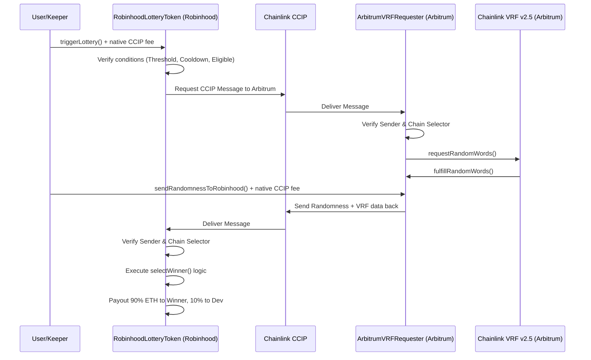

# Cross-Chain CCIP + VRF Lottery Architecture Report

## Overview
This document outlines the fully permissionless, cross-chain random lottery system for the Robinhood Lottery Token (RLOTTO). The architecture bridges the native Robinhood Chain Testnet (where the ERC-20 token and native ETH pool live) with Arbitrum Sepolia (where Chainlink VRF v2.5 provides cryptographically secure randomness). 

## 1. Architecture Diagram


## 2. Chain Roles
* **Robinhood Chain Testnet:** Hosts the core token logic, the ERC-20 Ledger, the tax collections, the native ETH Vault, the O(1) Log-Bucket Eligibility mapping, and the eventual payout execution.
* **Arbitrum Sepolia:** Acts purely as a robust, secure, Chainlink VRF Oracle source. It receives randomness requests, calls VRF, waits for fulfillment, and acts as a bridge source back to Robinhood.
* **Chainlink CCIP:** The secure message transport layer used to send requests and return randomness between chains.
* **Keeper Bot / SDK:** A permissionless off-chain actor that simply pays CCIP gas fees by triggering public functions (`triggerLottery()` and `sendRandomnessToRobinhood()`). It provides no randomness and has no administrative power.

## 3. Security Model & Trust Assumptions
* **No Block Randomness or Commit-Reveal:** All randomness is strictly provided by Chainlink VRF v2.5.
* **No Admin Interference:** The owner cannot arbitrarily trigger lotteries or influence the random selection. They only receive the hardcoded 10% dev fee from valid lotteries.
* **Permissionless Execution:** Anyone can call `triggerLottery()` or `sendRandomnessToRobinhood()`. The Keeper Bot is simply a convenience tool to automate it. If the bot goes offline, any community member can pay the CCIP fee and run it themselves.
* **Strict Sender Validation:** The Arbitrum Requester strictly requires incoming CCIP messages to originate from the precise Robinhood Lottery Token address, using Robinhood's unique Chain Selector. The reverse is true for Robinhood receiving randomness.

## 4. Required Config & Chain Selectors
**Robinhood Chain Testnet:**
* **Chain ID:** `46630`
* **CCIP Router:** `0x30D165D06A838708214a1e9481C73e1c66707e7C`
* **CCIP Chain Selector:** `2032988798112970440`

**Arbitrum Sepolia:**
* **Chain ID:** `421614`
* **CCIP Router:** `0x2a9C5afB0d0e4BAb2BCdaE109EC4b0c4Be15a165`
* **CCIP Chain Selector:** `3478487238524512106`
* **VRF v2.5 Coordinator:** `0x5CE8D5A2BC84beb22a398CCA51996F7930313D61`
* **VRF Key Hash:** `0x17706368d408f62363cfd29c362f6277b2123d2427a1c3272450539f7547d2be`

## 5. Keeper Bot & SDK
The system comes with a fully fleshed-out JavaScript SDK (`sdk/index.js`) and a reference Keeper Bot implementation (`bot/keeper.js`). 

**Usage Example:**
```javascript
// Start the keeper loop
node bot/keeper.js
```

The Keeper bot evaluates the Robinhood contract. If `canTriggerLottery` returns true (cooldown has passed, threshold met, no round currently in progress), it estimates the CCIP fee and executes `triggerLottery()`.

It also monitors the Arbitrum contract, checking if the VRF has been fulfilled but not yet broadcast back to Robinhood. If so, it calls `sendRandomnessToRobinhood()`.

## 6. Known Risks
* **CCIP Latency:** Cross-chain messaging takes time (often 10-30 minutes per leg depending on lane configuration and network congestion). The lottery round will be locked during this time.
* **DEX Availability:** Swap-to-native taxes rely on a UniswapV2 compatible DEX on Robinhood Testnet.
* **CCIP Funding:** A caller must have sufficient native ETH to pay the `ccipSend` fee. If native ETH spikes, CCIP messages could fail if users under-fund `msg.value`.
